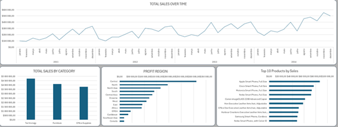

# Global Superstore Sales Dashboard (Excel)

## 📊 Project Overview
This project presents an end-to-end Business Intelligence solution built in **Microsoft Excel**, using the classic **Global Superstore** dataset.

The goal of the project is to analyze sales performance, profitability, order volume, and delivery efficiency across time, regions, and product categories using a clean data model and interactive dashboards.

---

## 🛠️ Tools & Technologies
- Microsoft Excel
- Power Query (ETL)
- Power Pivot (Data Model)
- DAX (Measures)
- Pivot Tables & Pivot Charts
- Slicers for interactivity

---

## 🧱 Data Model
A star schema was implemented using the following tables:

- **Fact Table**
  - Fact_Sales

- **Dimension Tables**
  - Dim_Date
  - Dim_Product
  - Dim_Customer
  - Dim_Geography

All relationships were created in **Power Pivot** following best BI modeling practices.

---

## 📐 Key Metrics (DAX Measures)
- Total Sales
- Total Profit
- Profit Margin
- Total Orders
- Average Delivery Days
- Average Order Value
- Profit per Order

All metrics were implemented as **DAX measures** to ensure dynamic filtering and accurate aggregation.

---

## 📈 Dashboard Features
- KPI cards for quick performance overview
- Sales trend over time (Year / Month)
- Sales by Category
- Profit by Region
- Top 10 Products by Sales
- Interactive slicers:
  - Year
  - Market
  - Category
  - Segment

---

## 📷 Dashboard Preview

---

## 📂 Repository Structure
global-superstore-dashboard-excel/
├── README.md
├── Excel_project.xlsx
├── data/
│ └── Global_Superstore2.csv
└── print_global.png

## 🚀 How to Use
1. Download the Excel file
2. Open it in Microsoft Excel (desktop version)
3. Enable content if prompted
4. Use slicers to explore the dashboard interactively

---

## 📌 Notes
- This project was developed for learning and portfolio purposes.
- The dataset is widely used for analytics practice.

---

## 👤 Author
**Renata de Araújo E.**
